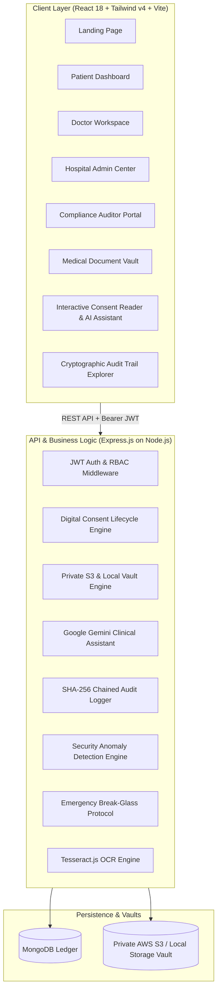

# 🛡️ ConsentIQ — Smart Patient Consent & Medical Document Management Portal

[](https://nodejs.org/)
[](https://react.dev/)
[](https://www.mongodb.com/)
[](https://tailwindcss.com/)
[](https://ai.google.dev/)
[](#compliance--security-safeguards)

> **ConsentIQ** is an enterprise-grade, patient-centric healthcare platform engineered to modernize medical informed consent, secure clinical document lifecycle management, and provide cryptographically verifiable audit trails. Powered by Google Gemini AI, it translates dense clinical jargon into patient-friendly reading material without ever diagnosing or altering legal parameters.

---

## 🏛️ System Architecture



---

## 🚀 Key Feature Matrix

| Module | Features & Capabilities |
| :--- | :--- |
| **Authentication & RBAC** | Multi-role JWT tokens (`PATIENT`, `DOCTOR`, `ADMIN`, `AUDITOR`), bcrypt password hashing, 1-click quick-login demo accounts, automatic account lockout protections. |
| **Role Dashboards** | Custom interfaces with Recharts analytics, upcoming expirations, pending consent banners, break-glass session monitors, and access transparency feeds. |
| **Document Vault** | Multi-category uploads (`Blood Report`, `MRI`, `CT Scan`, `X-Ray`, `Prescription`, `Discharge Summary`, `Surgery Report`, `Consent`, `Insurance`), automated semantic versioning (`v1.0` $\to$ `v2.0`), parent document tracking, and time-limited pre-signed URLs. |
| **Digital Consent Flow** | Structured clinical consent drafting, automatic versioning lineage, revocation with clinical reason, digital OTP signing, and cryptographic SHA-256 signature hashing. |
| **Gemini AI Comprehension** | Translates medical jargon into plain English at a 6th-grade level, explains complex terms in under 50 words with analogies, and generates procedure-specific comprehension quizzes. Strictly adheres to clinical safety disclaimers (no diagnosing/prescribing). |
| **Cryptographic Audit Ledger** | Immutable, blockchain-like SHA-256 hash chaining where every log block links to its predecessor. Interactive verification tool checks the entire ledger for mutations. CSV and JSON export. |
| **Emergency Break-Glass** | Clinicians can invoke 4-hour emergency overrides for unconscious or trauma patients with mandatory justifications. Dispatches immediate alerts to patients and security admins, and logs every document accessed. |
| **Security Anomaly Engine** | Detects unusual rapid access spikes ($>8$ views in 5 min), repeated failed logins ($\ge 3$ in 10 min), and unauthorized IDOR attempts. Alerts can be reviewed and resolved in the Admin Center. |
| **Tesseract OCR Engine** | Optical character recognition on uploaded images and PDFs extracts clinical text, enabling full-text keyword searches across document bodies. |
| **In-App Notifications** | Live notification bell in the navigation bar with automated 25-second polling, categorized badges, and 1-click routing to related records. |

---

## 🔑 Demo Credentials

The platform is pre-seeded with full clinical datasets. Use the 1-click buttons on the login page or enter the credentials below:

| Role | Email Address | Password | Permissions & Dashboard |
| :--- | :--- | :--- | :--- |
| **Patient** | `patient@hospital.demo` | `Password123!` | Access personal vault, review/accept/withdraw consents, view audit feed. |
| **Doctor** | `doctor@hospital.demo` | `Password123!` | Upload diagnostics, issue digital consents, trigger emergency break-glass. |
| **Admin** | `admin@hospital.demo` | `Password123!` | Global clinical analytics, role administration, security anomaly resolution. |
| **Auditor** | `auditor@hospital.demo` | `Password123!` | Read-only ledger verification, hash chain validation, compliance exports. |

---

## 🔒 Compliance & Security Safeguards

- **HIPAA Security Rule § 164.312(b)**: Audit controls record and examine all activity in systems containing or using Electronic Protected Health Information (ePHI).
- **Cryptographic Hash Chain**: Every transaction is hashed using SHA-256:
  $$\text{entryHash} = \text{SHA-256}(\text{previousHash} \parallel \text{timestamp} \parallel \text{action} \parallel \text{resourceType} \parallel \text{resourceId} \parallel \text{userId} \parallel \text{status} \parallel \text{metadata})$$
- **GDPR Art. 9 Transparency**: Patients maintain continuous access transparency and can review which clinicians accessed their medical charts and download personal data.
- **AI Safety Boundaries**: AI models run with prompt-level guardrails prohibiting treatment recommendations, clinical decisions, or capacity determinations.

---

## 🛠️ Installation & Setup

### Prerequisites
- **Node.js** v18.0.0 or higher
- **MongoDB** running locally on `localhost:27017` or a MongoDB Atlas URI

### 1. Repository Setup
```bash
git clone https://github.com/your-org/consentiq.git
cd "smart patient consent and document management portal"
```

### 2. Backend Configuration (`server`)
```bash
cd server
npm install
```

Configure your environment variables in `server/.env`:
```env
PORT=5000
MONGODB_URI=mongodb://127.0.0.1:27017/consentiq
JWT_SECRET=super_secret_consentiq_jwt_key_2026_clinical
CLIENT_URL=http://localhost:5173

# Optional: Cloud Integrations (Graceful offline fallback built-in)
GEMINI_API_KEY=your_gemini_api_key_here
AWS_ACCESS_KEY_ID=
AWS_SECRET_ACCESS_KEY=
AWS_REGION=us-east-1
AWS_S3_BUCKET=
```

Seed the database with clinical demo data:
```bash
npm run seed
```

Start the backend API server:
```bash
npm run start
```

### 3. Frontend Configuration (`client`)
```bash
cd ../client
npm install
npm run dev
```

The portal will be live at: **`http://localhost:5173`**  
The API will be live at: **`http://localhost:5000`**

---

## 📡 API Endpoint Reference

### Authentication & Profiles
- `POST /api/auth/register` — Register a new patient or clinician account
- `POST /api/auth/login` — Authenticate and receive signed JWT
- `GET /api/auth/me` — Retrieve authenticated user profile and clinical role

### Dashboards
- `GET /api/dashboard/patient` — Retrieve patient KPI cards, pending consents, and transparency feed
- `GET /api/dashboard/doctor` — Retrieve clinician workspace metrics, patients, and expirations
- `GET /api/dashboard/admin` — Retrieve hospital-wide analytics, department charts, and security alerts
- `GET /api/dashboard/auditor` — Retrieve immutable audit feed and query metrics

### Medical Documents & OCR
- `POST /api/documents` — Multipart file upload with automated versioning and OCR extraction
- `GET /api/documents` — List documents with category and full-text OCR search
- `GET /api/documents/:id` — Retrieve document metadata and complete version history
- `GET /api/documents/:id/download` — Obtain a time-limited pre-signed download URL
- `POST /api/documents/:id/ocr` — Trigger on-demand Tesseract optical text extraction
- `DELETE /api/documents/:id` — Archive a medical document

### Digital Consents & Gemini AI
- `POST /api/consents` — Issue a new clinical consent agreement with procedural details
- `GET /api/consents` — List consents filtered by status and patient
- `GET /api/consents/:id` — Inspect consent agreement (automatically marks status as `VIEWED`)
- `POST /api/consents/:id/accept` — Digitally accept with OTP and cryptographic signature hashing
- `POST /api/consents/:id/reject` — Decline a consent agreement
- `POST /api/consents/:id/revoke` — Withdraw an active consent with mandatory clinical justification
- `POST /api/consents/:id/explain` — Gemini AI plain-language summary translation
- `POST /api/consents/explain-term` — Gemini AI medical term simplifier
- `GET /api/consents/:id/quiz` — Procedural comprehension check quiz generator

### Audit Ledger & Compliance
- `GET /api/audit-logs` — Query audit logs with multi-attribute filtering and pagination
- `GET /api/audit-logs/stats` — Ledger event counts and breakdown
- `GET /api/audit-logs/verify-chain` — Recalculate and verify SHA-256 cryptographic hash chain
- `GET /api/audit-logs/export` — Export ledger data to CSV or JSON format

### Emergency Break-Glass
- `POST /api/emergency/break-glass` — Declare 4-hour emergency override access with clinical reason
- `GET /api/emergency/active` — List currently active break-glass sessions
- `POST /api/emergency/:id/end` — Terminate an active emergency session early
- `GET /api/emergency/history` — Audit log of all historical break-glass invocations

### Security Anomaly Center
- `GET /api/security/alerts` — Query flagged security anomalies and threats
- `PUT /api/security/alerts/:id/resolve` — Acknowledge and resolve a security alert
- `GET /api/security/metrics` — Threat telemetry summary

### Notifications
- `GET /api/notifications` — Retrieve user notifications with unread counter
- `PUT /api/notifications/:id/read` — Mark notification as read
- `PUT /api/notifications/read-all` — Mark all notifications as read
- `DELETE /api/notifications/:id` — Dismiss a notification

---

## 🧪 Verification & Automated Testing

All phases include automated test suites:
- `test_phase_7_8.mjs` — Validated audit hash chains, CSV/JSON export, and in-app notifications.
- `test_phase_12_13.mjs` — Validated emergency break-glass sessions, automatic notifications, and threat resolution.
- `test_ocr.mjs` — Validated Tesseract OCR optical character recognition and full-text document discovery.
- `test_consents.mjs` — Validated digital consent versioning, Gemini AI summaries, term simplifier, and SHA-256 signature hashes.

---

## 📄 License
This project is licensed under the MIT License for healthcare software development and compliance evaluation.
